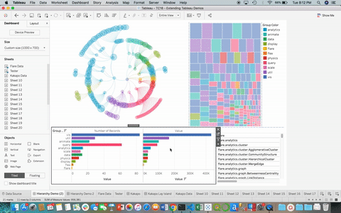
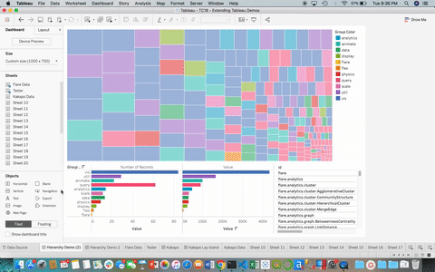
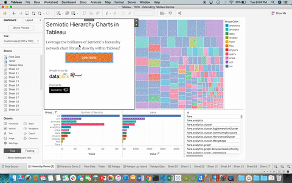
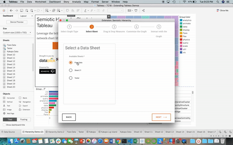
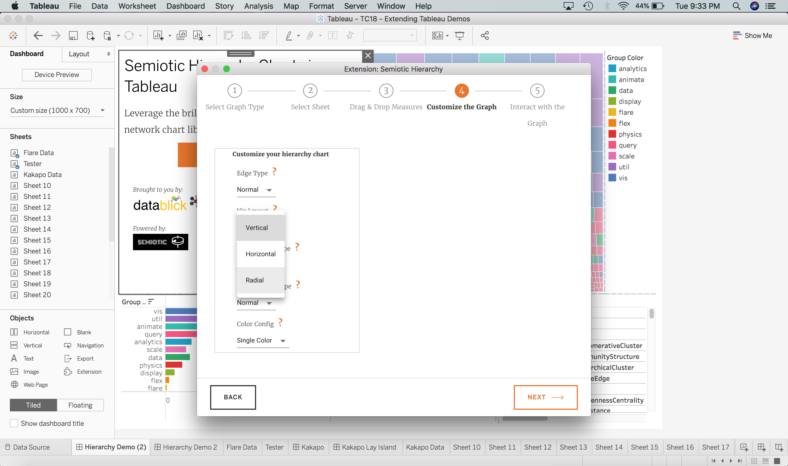
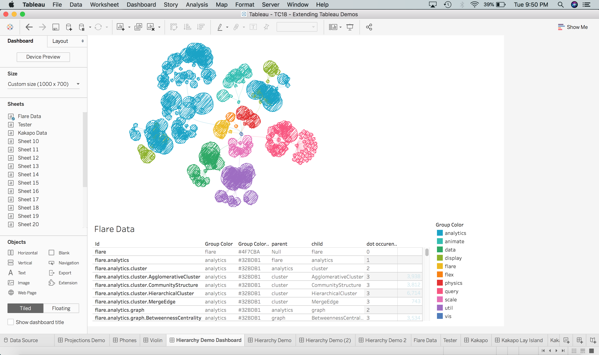

# Semiotic Hierarchy Charts in Tableau

## Credits
These individuals played a key role in making this thing happen, thanks to all of you!
- Tamas Foldi
- Abraham Szilagyi
- Elijah Meeks (Creator of Semiotic)

## Introduction



This is the semiotic hierarchy tableau extension. It will load a semiotic hierarchy visualization inside your Tableau Desktop, or Server App. We have built an intuitive UI to enable the user to leverage many different configurations that you can pass directly into Semiotic. This includes the ability for your instance of the extension to communicate with your other Tableau charts.

This extension is supported on **Tableau Desktop >= 2018.3** and **Tableau Server**. Currently this extension is not sandboxed, but it could be. Also it has not been enabled by the Tableau Public team. 

## Env Requirements
Tableau Desktop >= 2018.3 and Tableau Server, sadly not Tableau Public.

## Quick Start
#### Step 1: Locate the Semiotic Hierarchy Extension on the [community extensions page](https://tableau.github.io/extensions-api/community/), or download the trex from the public directory of this repo. Either of these methods will allow you to download the .trex file locally on your machine.

#### Step 2: Open your dashboard and load the extension object onto the canvas. If prompted, click ‘Allow’ to permit the extension to run on your dashboard. 



#### Step 3: Customize your hierarchy chart
There are several steps you will go through to customize the look, feel and interactivity of your hierarchy chart, our goal is to allow you to make this extension one with your Tableau Dashboard. You start this process by clicking the "Configure" button, or selecting configure from the Tableau menu. These steps include: 

- Select a type of hierarchy visualization


- Select a sheet that is on your dashboard and contains you hierarchy data. Here is an example table of what is required for hierarchy data for this extension to work correctly. 

Parent Node | Child Node | Some Value | Color By | Other Stuff(n)
--- | --- | ---: | --- | ---
null | rootNode | 100 | black | categoryValue
rootNode | child1 | 20 | blue | categoryValue2
rootNode | child2 | 20 | green | categoryValue1
child1 | child3 | 100 | blue | categoryValue2
child1 | child4 | 100 | blue | categoryValue2
child2 | child5 | 100 | green | categoryValue1

**Please take note:** that there must be one, and only one record which has a null parent (even if it is fake), this is the `root node` of your hierarchy from which all things are made, if you do not provide a single root node (in the souce data sheet), the extension will crash. 

- Drag & Drop the fields identified from your source sheet to their corresponding role of your hierarchy. 



- Customize how your semiotic hierarchy chart will look and feel.



- Determine how your semiotic hierarchy chart will interact with your Tableau dashboard.


**The semiotic hierarchy extension is a client-side app.Your data stays in your Tableau application.**

#### Step 4: Save your Dashboard to persist the selections into your workbook, the updates you have made will not persist until you save the Tableau file. 

#### Step 5: Re-configure and re-save
You can continue to adjust your configurations and settings to your delight, just remember to save your updates when you are done. If you want to have some fun, check out the `sketchy` render modes!



#### Step 6: Submit Feedback and Help us Test!
You can log any feedback, feature requests and/or issues you come across directly on our [github issues](https://github.com/demartsc/tableau-semiotic-hierarchy/issues) page. What else do you want to do with this thing? Let us know!

## Local Development Setup
For a development installation (requires npm, node and yarn):

Install [node](https://nodejs.org/en/download/package-manager/) (`> 8.15.0`), [yarn](https://yarnpkg.com/en/docs/install). For best management of Node versions, use [nvm](https://github.com/creationix/nvm)
then simply run `nvm use 8`.

This project was bootstrapped with [Create React App](https://github.com/facebookincubator/create-react-app).

### Start local app
##### 1. Clone repo
```sh
git clone git@github.com:demartsc/tableau-semiotic-hierarchy.git
```

##### 2. Install
```sh
yarn
# or
npm install
```


##### 3. Start local app session
```sh
yarn start
# or
npm start
```

### Setup local extension in Tableau Desktop
##### 1. Launch Tableau
open tableau workbook (get it from public folder of this repo)
- NOTE: if you want to enable remote debugging, use this command in terminal to open tableau (be sure to update the tableau version number)

```sh
open /Applications/Tableau\ Desktop\ 2020\.1.app --args --remote-debugging-port=8696
```

A debug session will be available in browser http://localhost:8696 or chrome://inspect#devices

##### 2. Execute extension in tableau

- copy the `datablick-semiotic-hierarchy-local.trex` file (inside the `public` folder) into your `extensions` folder of the `My Tableau Repository` (likely in your `Documents` folder).

- Go to the Tableau window that opened when running the above command.

- Drag the extension onto view and select the trex file from your my tableau repository\extensions folder.

- More information on [Tableau Extensions API](https://tableau.github.io/extensions-api/#) about [Get Started with Dashboard Extensions
](https://tableau.github.io/extensions-api/docs/trex_getstarted.html)

### Deploy
```sh
npm run deploy
```

## Links
- [Semiotic documentation](https://semiotic.nteract.io/)
